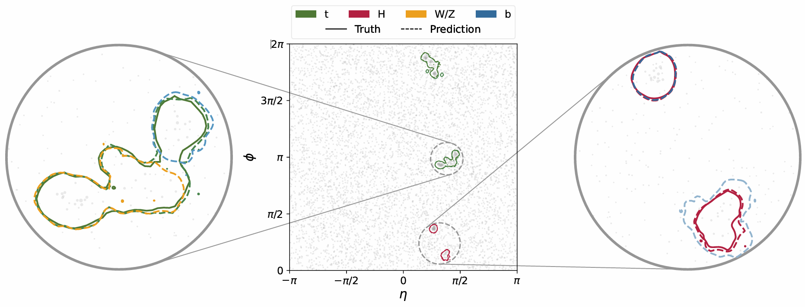

# __<p align=center>Segment Any SM-Jet</p>__

__<p align=center>Detecting Htt event</p>__
<div align=center>
   <figure>
      
   </figure>
</div>

Paper: arxiv.xxxx 

## Requirements
* Only Linux is supported.
* One or more high-end NVIDIA GPUs(at least 24 GB of DRAM).
* 64-bit Python3.10(or higher, recommend 3.10) installation.
* Pytorch2.4+cuda11.8, causal-conv1d==1.14.0, mamba-ssm==2.2.2, pulp==3.1.1.

## Environment Configuration
* Mamba install: https://github.com/state-spaces/mamba
* VMamba install: https://github.com/MzeroMiko/VMamba

## Preparing Dataset
We provide a C++ code to convert the output of Madgraph+Delphes into the format required for model training.
* ### main.cpp
Set the root file to be analyzed and the PID of the particle to be assigned to the final state.
```
RootExtract extract(path_to_root_file);
vector<int>> pid_list = {25, 6, -6, 5, -5, 24, -24, 1, -1, 2, -2, 3, -3, 4, -4}; // If it is an Htt event.

extract.AssignFinalState(pid_list, path_to_save_file);
```
After compiling and running, the program will read `path_to_root_file` and save the result to `path_to_save_file`.
* ### transform.py
This code will read the `.dat` (e.g., `path_to_save_file` in the previous step) file in the specified folder and use MILP solver to perform final state assignment, and save the result `event.npy` in the specified folder.

___Notice___: the converted file can also be used directly for inference, but if only use the inference, a more convenient method is to convert the Delphes root file into a [H, W, 6] tensor.
